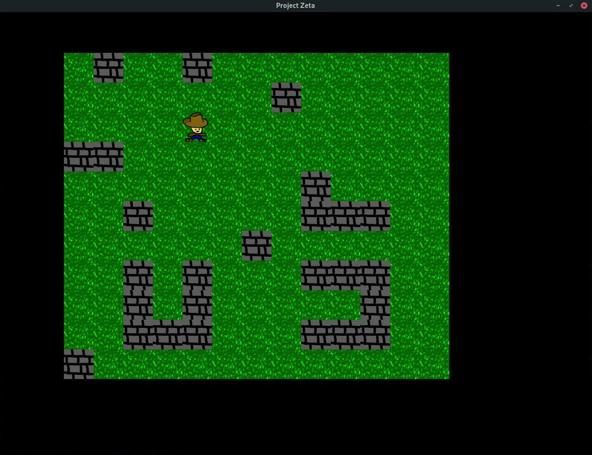

# PROJECT-ZETA
#### Created by Dante Hoyle
## Project Goal
This project's goal will be to make a rogue like in C++ using the SFML library

## Current State
Right now, the 'game' has a world which a player character can move through. The user can use the mouse to draw and remove tiles.

### Controls
- UP, DOWN, LEFT, & RIGHT arrow keys control player movement
- W, A, S, & D moves the camera through the world
- Left click adds grass blocks the palyer can walk on top of
- Q adds wall blocks the player cannot move through
- R clears the entire board
- Right click removes the block the mouse is currently over

## Important features to add
### Enemies
The game will eventually feature enemies that can be attacked and will attack the player. enemy types may include melee, ranged, and enemies which can move through walls (ghost, flying, etc)

### Items
The player should be able to equip items that help them in combat. This may include 
- Weapons
- Armor
- Magic Rings and Jewlery
- Trinkets
- Consumable items (potions, food, etc.)

Items should boost stats and increase player ability. I would like to add Diablo style weapon modifiers that can effect specific skills

### Randomly Generated Map
The levels the player goes through should be randomly generated with monsters, loot, and paths to take.

## Screenshots
